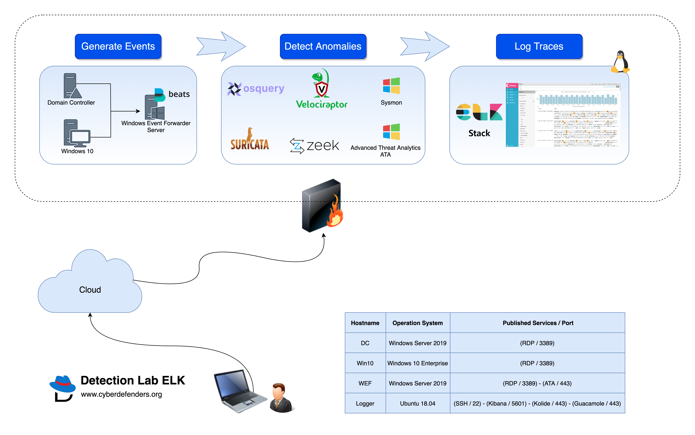

# DetectionLabELK

DetectionLabELK is a fork from Chris Long's [DetectionLab](https://github.com/clong/DetectionLab) with ELK stack instead of Splunk.

This is a fork of cyberdefenders [DetectionLabELK](https://github.com/cyberdefenders/DetectionLabELK) which according to their github 
repo is no longer maintained as of may 2020.

## Description:

DetectionLabELK is the perfect lab to use if you would like to build effective detection capabilities. It has been designed with defenders in mind. Its primary purpose is to allow blueteams to quickly build a Windows domain that comes pre-loaded with security tooling and some best practices when it comes to system logging configurations. It can easily be modified to fit most needs or expanded to include additional hosts.

## Use cases:

A popular use case for DetectionLabELK is when you consider adopting MITRE ATT&CK framework and would like to develop detections for its tactics. You can use DetectionLabELK to quickly run atomic tests, see what logs are being generated and compare it to your production environment. This way you can:

- Validate that your production logging is working as expected.
- Ensure that your SIEM is collecting the correct events.
- Enhance alerts quality by reducing false positives and eliminating false negatives.
- Minimize coverage gaps.

## Lab Information:

- **Domain Name**: windomain.local
- **Windows Admininstrator login**: vagrant:vagrant
- **Fleet login**: https://192.168.38.105:8412 - vagrant:vagrant
- **Kibana login**: http://192.168.38.105:5601 - vagrant:vagrant
- **Microsoft ATA login**: https://192.168.38.103 - vagrant:vagrant
- **Guacamole login**: http://192.168.38.105:8080/guacamole - vagrant:vagrant
- **Velociraptor**: https://192.168.38.105:9999 - vagrant:vagrant

## Primary Lab Features:

- [Microsoft Advanced Threat Analytics](https://www.microsoft.com/en-us/cloud-platform/advanced-threat-analytics) is installed on the WEF machine, with the lightweight ATA gateway installed on the DC
- Windoes Evenet forwarder along with Winlogbeat are pre-installed and all indexes are pre-created on ELK. Technology add-ons for Windows are also preconfigured.
- A custom Windows auditing configuration is set via GPO to include command line process auditing and additional OS-level logging
- [Palantir's Windows Event Forwarding](http://github.com/palantir/windows-event-forwarding) subscriptions and custom channels are implemented
- Powershell transcript logging is enabled. All logs are saved to `\\wef\pslogs`
- osquery comes installed on each host and is pre-configured to connect to a [Fleet](https://kolide.co/fleet) server via TLS. Fleet is preconfigured with the configuration from [Palantir's osquery Configuration](https://github.com/palantir/osquery-configuration)
- Sysmon is installed and configured using Olaf's open-sourced configuration
- All autostart items are logged to Windows Event Logs via [AutorunsToWinEventLog](https://github.com/palantir/windows-event-forwarding/tree/master/AutorunsToWinEventLog)
- SMBv1 Auditing is enabled

## Lab Hosts:

1.  **DC - Windows 2016 Domain Controller**

    - WEF Server Configuration GPO
    - Powershell logging GPO
    - Enhanced Windows Auditing policy GPO
    - Sysmon
    - osquery
    - Elastic Beats Forwarder (Forwards Sysmon & osquery)
    - Sysinternals Tools
    - Microsft Advanced Threat Analytics Lightweight Gateway

2.  **WEF - Windows 2016 Server**

    - Microsoft Advanced Threat Analytics
    - Windows Event Collector
    - Windows Event Subscription Creation
    - Powershell transcription logging share
    - Sysmon
    - osquery
    - Elastic Beats Forwarder (Forwards WinEventLog & Powershell & Sysmon & osquery)
    - Sysinternals tools

3.  **Win10 - Windows 10 Workstation**

    - Simulates employee workstation
    - Sysmon
    - osquery
    - Sysinternals Tools

4.  **Logger - Ubuntu 18.04**
    - Kibana
    - Fleet osquery Manager
    - Bro
    - Suricata
    - Elastic Beats Forwarder (Forwards Bro logs & Suricata & osquery)
    - Guacamole
    - Velociraptor

## Requirements

- 55GB+ of free disk space
- 16GB+ of RAM
- Vagrant 2.2.2 or newer
- Virtualbox

## Deployment Options

1.  **Use Vagrant Cloud Boxes - ETA ~2 hours**.

    - [Install Vagrant](https://www.vagrantup.com/downloads.html) on your system.
    - [Install Packer](https://packer.io/downloads.html) on your system.
    - Install the Vagrant-Reload plugin by running the following command: `vagrant plugin install vagrant-reload`.
    - Download DetectionLabELK to your local machine by running `git clone https://github.com/cyberdefenders/DetectionLabELK.git` from command line OR download it directly via [this link](https://github.com/cyberdefenders/DetectionLabELK/archive/master.zip).
    - `cd` to "DetectionLabELK/Vagrant" and execute `vagrant up`.

2.  **Build Boxes From Scratch - ETA ~5 hours**.

    - [Install Vagrant](https://www.vagrantup.com/downloads.html) on your system.
    - [Install Packer](https://packer.io/downloads.html) on your system.
    - Install "Vagrant-Reload" plugin by running the following command: `vagrant plugin install vagrant-reload`.
    - Download DetectionLabELK to your local machine by running `git clone https://github.com/cyberdefenders/DetectionLabELK.git` from command line OR download it directly via [this link](https://github.com/cyberdefenders/DetectionLabELK/archive/master.zip).
    - `cd` to "DetectionLabELK" base directory and build the lab by executing `./build.sh virtualbox` (Mac & Linux) or `./build.ps1 virtualbox` (Windows).

## Troubleshooting:

- To verify that building process completed successfully, ensure you are in `DetectionLabELK/Vagrant` directory and run `vagrant status`. The four machines (wef,dc,logger and win10) should be running. if one of the machines was not running, execute `vagrant reload <host>`. If you would like to pause the whole lab, execute `vagrant suspend` and resume it using `vagrant resume`.
- Deployment logs will be present in the `Vagrant` folder as `vagrant_up_<host>.log`

## Lab Access:

- Navigate to https://192.168.38.105:8080/guacamole in a browser to access Guacamole. Default credentials are vagrant:vagrant.
- Navigate to https://192.168.38.105:5601 in a browser to access the Kibana dashboard on logger. Default credentials are vagrant:vagrant.
- Navigate to https://192.168.38.105:8412 in a browser to access the Fleet server on logger. Default credentials are vagrant:vagrant.
- Navigate to https://192.168.38.103 in a browser to access Microsoft ATA. Default credentials are vagrant:vagrant.
- Navigate to https://192.168.38.105:9999 in a browser to access velociraptor. Default credentials are vagrant:vagrant.

**Support**: If you face any problem, please open a new [issue](https://github.com/cyberdefenders/DetectionLabELK/issues) and provide relevant log file.
